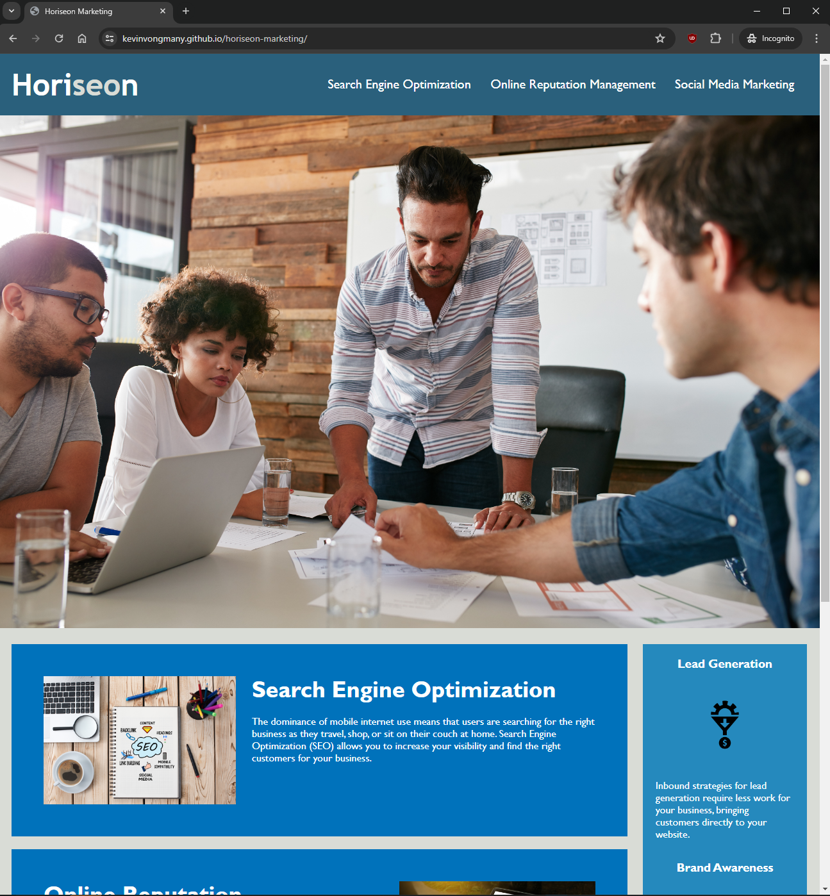
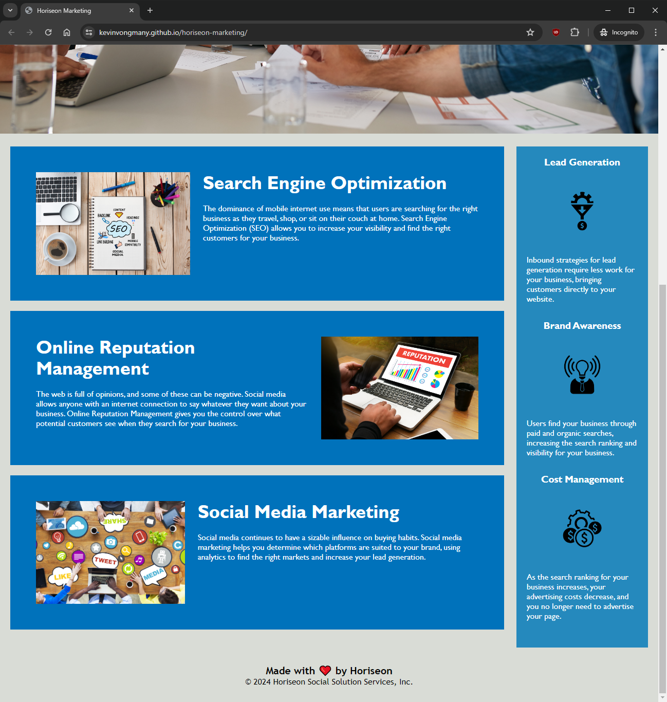

# Webpage Accessibility Challenge
This repository contains refactored source code for Week 1's bootcamp challenge.
The refactoring of this source code includes:
- Updating non-semantic HTML elements to semantic elements
- Removing redundant CSS stylings applied across
- Structuring the HTML elements to be more meaningful
- Added suitable webpage title
- Removed redundant html & css classes
- In-file comments detailing the changes to the refactored code.

## Deploy

The final webpage for this can be accessed here: https://kevinvongmany.github.io/horiseon-marketing/.

Users can access the HTML source code through the repo or within a Chromium/Firefox browser by pressing `F12`, `CTRL+SHIFT+I` (Windows) or `CMD+SHIFT+I` (MacOS). 

## Sample

Samples of final webpage can be found here:



## HTML CSS Git Challenge: Code Refactor

This week's challenge involves a very important aspect of web development: **accessibility**. 

One of the most common tasks for front-end and junior developers is to take existing code and refactor it (recall that to refactor code is to improve it without changing what it does) to meet a certain set of standards or implement a new technology. In this Challenge, a marketing agency has hired you to refactor an existing site to make it more accessible. 

> **note** Your coursework this week will prepare you with all the skills that you need to succeed on this assignment!

Web accessibility is an increasingly important consideration for businesses. It ensures that people with disabilities can access a website using assistive technologies such as video captions, screen readers, and braille keyboards. Making a website accessible is also good for business for many reasons, one of them being that accessible sites are better positioned in search engines like Google. It also helps companies avoid litigation that can occur when people with disabilities can't access their website.

Even though accessibility is a broad topic that can include complex requirements, your tech lead has given you a small list of specific criteria to satisfy the project. These criteria are documented in the Acceptance Criteria section.

> **important** An important rule to follow when working with someone else's code is the **Scout Rule**, which recommends that you always leave the code a little cleaner than when you found it.

To impress clients, you should always go the extra mile and improve the codebase for long-term sustainability. For example, make sure that all links are functioning correctly. Also, rework the CSS to make it more efficient by consolidating CSS selectors and properties, organizing them to follow the semantic structure of the HTML elements, and including comments before each element or section of the page.

Are you ready to jump in? Here are this week's challenge requirements: 

### User Story

```md
AS A marketing agency
I WANT a codebase that follows accessibility standards
SO THAT our own site is optimized for search engines
```

### Acceptance Criteria

```md
GIVEN a webpage meets accessibility standards
WHEN I view the source code
THEN I find semantic HTML elements
WHEN I view the structure of the HTML elements
THEN I find that the elements follow a logical structure independent of styling and positioning
WHEN I view the image elements
THEN I find accessible alt attributes
WHEN I view the heading attributes
THEN they fall in sequential order
WHEN I view the title element
THEN I find a concise, descriptive title
```

### Mock-Up

> **note** This layout is designed for "desktop", so you may notice that some of the elements don't look like the Mock-Up when viewed at a resolution smaller than 768px. In future lessons, you will learn how to make elements "responsive" so that your web application is optimized for any screen size.

The following image shows the web application's appearance and functionality:


